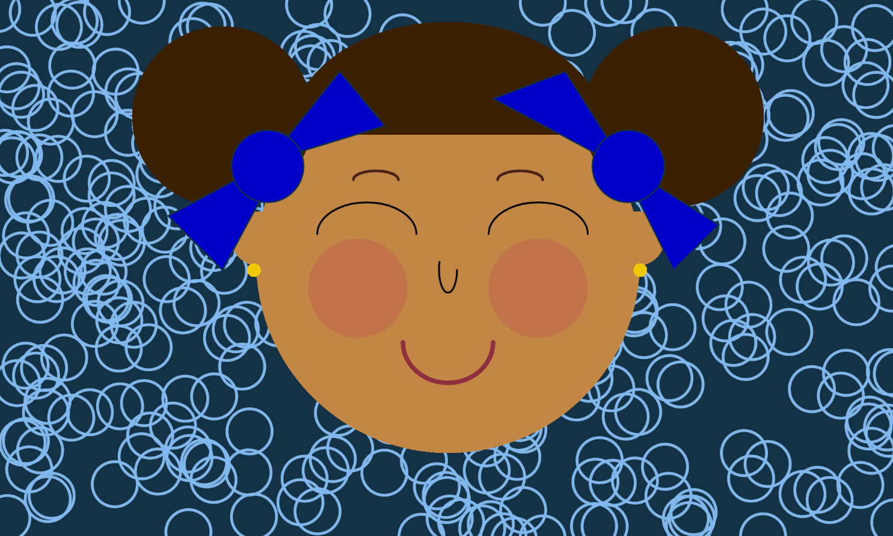

# Art Jam - Smiling Lady

Ashmitha Kanagiah

[View this project online](https://ashmyytaa.github.io/cart253/jams/art-jam/)

## Description

*Smiling Lady* is a cute portrait of a lady that is smiling her way through life. She
is radiating a positive attitude and a great energy. The user is able to engage with this portait using its mouse in various ways.

Mouse interaction: 

> When the mouse is pressed, wherever on the canvas, the hair of smiling lady changes colors. It changes from a dark brown color, to a light brown color!

> When the user hovers its mouse on the cheeks of smiling lady, the cheeks changes colors. Goes from a pink color, to a reddish color.

Animations:

> The background projects circles, mimicking bubbles, that pops out randomly at different positions, every second.

> The bow button changes size. It gets bigger gradually until it reaches a maximum size.

> The bow fills are changing shades. Goes from a light blue color, to a vibrant blue color.

This projects allows the user to interact with the portait with its mouse, as well as it included animations that I designed!

## Screenshot(s)

Here is a screenshot that shows how my portait looks like: 

> 

## Attribution

For the code of my project, I referred to the p5.js reference website, as well as all the course materials, and in-class challenges done so far. As well as the examples gaven by the teacher. 

> - This project uses [p5.js](https://p5js.org).

## License

No extra licence have been added to my project.

> This project is licensed under a Creative Commons Attribution ([CC BY 4.0](https://creativecommons.org/licenses/by/4.0/deed.en)) license with the exception of libraries and other components with their own licenses.