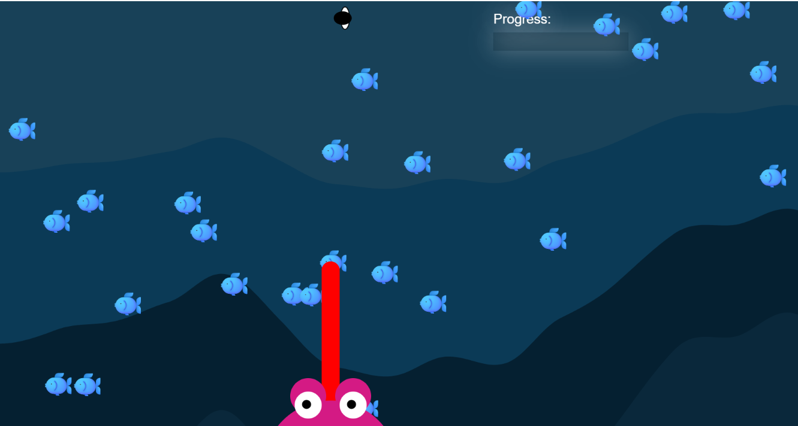

# Mod Jam - Frog Diving

Ashmitha Kanagiah

[View this project online](https://ashmyytaa.github.io/cart253/jams/mod-jam/)

## Description

*Frog Diving* is a simple game where the user has to catches flies using the frog's tongue. The more you catch flies, the more you enter the depth of the ocean. At the end, you will reach the big treasure, which is a gold mine filled with gold. There is no loosing in the game, you are only winning, as long as you catch all the fishes and get to the gold mine!

Mouse interaction: 

> When the mouse is pressed:
- Tongue of frog expands to catch the flies.
- Adds a new fish to the background

> New features I added:
- Backgroung music
- Used perlin noise to create my backgrounds for all my water depts. 
- Eyes moving along the cursor
- Title screen
- Progress bar

This projects allows the user to enjoy the game and be pleased at all the aesthetics and movements. 

## Screenshot(s)

Here is a screenshot that shows how my game looks like:

> 

## Attribution

For the code of my project, I referred to the p5.js reference website, as well as all the course materials, and in-class challenges done so far. As well as the examples gaven by the teacher. I also used youtube to watch videos on how to create certain features. 

> - This project uses [p5.js](https://p5js.org).

## License

No extra licence have been added to my project.

> This project is licensed under a Creative Commons Attribution ([CC BY 4.0](https://creativecommons.org/licenses/by/4.0/deed.en)) license with the exception of libraries and other components with their own licenses.
