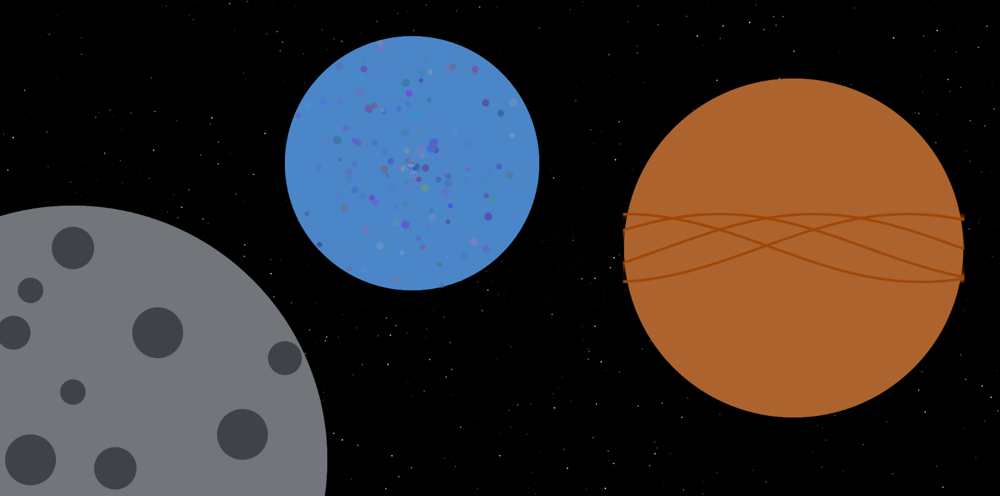
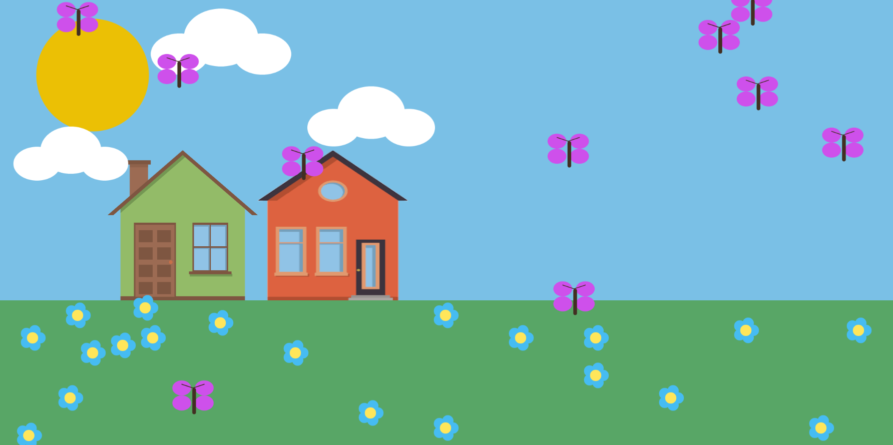
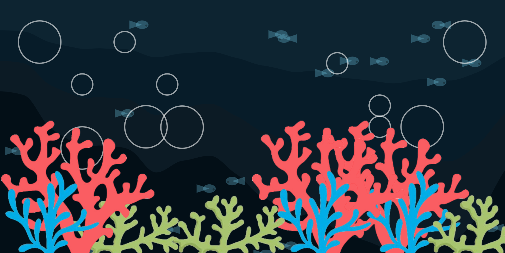
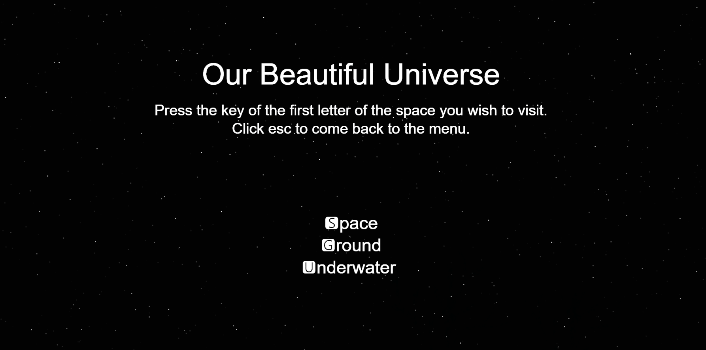

# Variation Jam - Our Beutiful Universe

Ashmitha Kanagiah

[View this game online](https://ashmyytaa.github.io/cart253/jams/variation-jam/)

## Description

*Our Beautiful Universe* is a simple animation that is composed of three different spaces that the user can enter into. The ground, the space and the underwater. Each variation is a fully animated visual that represents what which spaces the variation is trying to portrait. For some more fun, there is also user interactions included, where there the user can interact with the variations. It contains also a menu screen where it contains keyboard keys that the user should press, to be transported in its preffered variation.

> *Space Variation* is a beatiful variation that shows the space and three planets that is floating on it. Each planet is animated in some ways as well as this variation contains two ways in where the user can interact with the variation. (Specifics will be provided further down.)

> *Ground Variation* is a variation that shows a calming landscape. There are animations in this variation that makes the landscape look visually pleasing and moving as well as this variation contains one way where the user can interact with it. (Specifics will be provided further down.)

> *Underwater Variation* is a variation that shows a portion of the underwaters of the ocea. This variation is heavily inspired by my mod-jam, as the core idea and aethetics are being used in my mod-jam. This variation also contains one way in which the user can interact with it (Specifics will be provided further down.)

## Technical specifications

I will present how the user can interact with each of my variations:

> Space Variation
- User can hover its mouse on the moon craters that belongs on the gray planet, and they can watch the moon craters change colors!
- User can press on the mouse to see a star that appears and fades away. Can click as much as you want to see a star appear and disappear.

> Ground Variation
- User can click on the mouse anywhere on the canvas for the colors of the background and ground to change.
- User can click on "r" or "R", for raindrops to fall from top to bottom. 

> Underwater Variation
- User can move the bubbles that are on the canvas by moving the mouse. The bubbles move away from the mouse, whenever the mouse is in its range.

> Menu page
- User clicks on the keys that are told on the menu page, to be transported in its preffered variation.

## Screenshot(s)

Here is a screenshot that shows how my variations looks like:

> 
> 
> 
> 

## Attribution

For the code of my project, I referred to the p5.js reference website, as well as all the course materials, and in-class challenges done so far. References also come from in-class examples shows my the teacher such as the "Moving Stones" example, the "Overlapping Circles" example, as well as "Denying Stamp". Weekly challlenges in our class, such as the one for the week we learned arrays, its challenge inspired for my butterflies and fishes animations. The p5.js reference website had features that inspired me for my codes, such as the noise() function and the particles system materials. 

> - This project uses [p5.js](https://p5js.org).
> - All my images used for my variation jam are from Google Images.

## License

No extra licence have been added to my project.

> This project is licensed under a Creative Commons Attribution ([CC BY 4.0](https://creativecommons.org/licenses/by/4.0/deed.en)) license with the exception of libraries and other components with their own licenses.